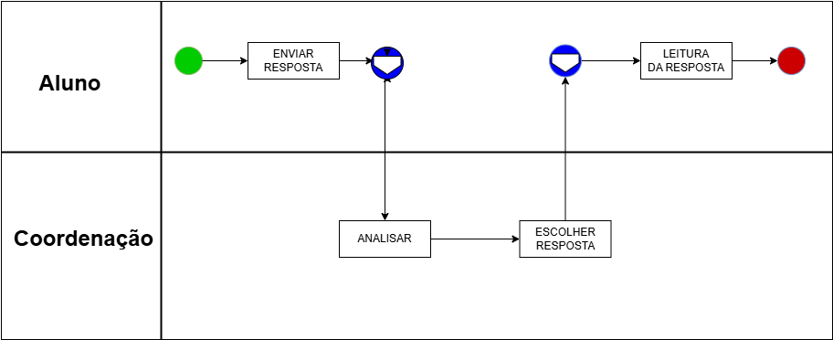
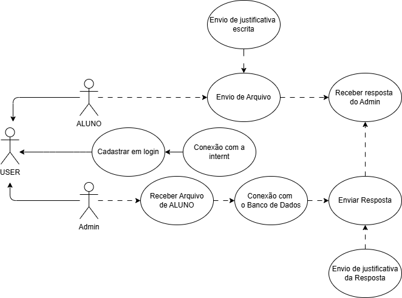
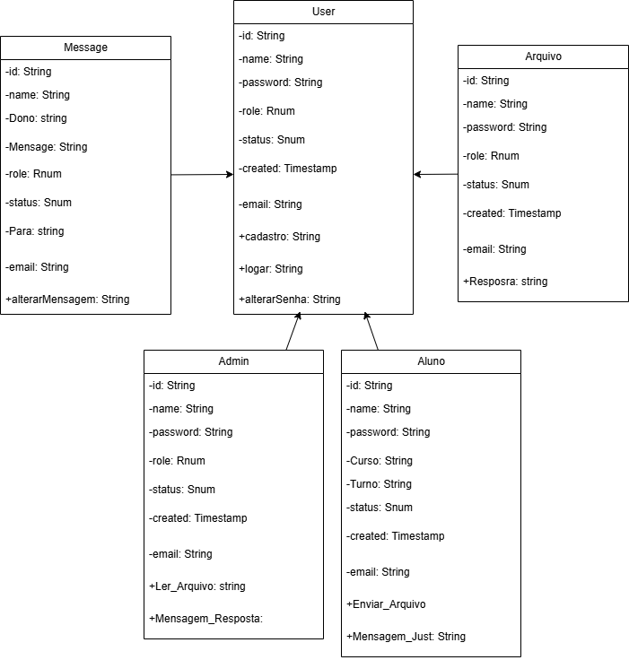

= Documentação de Levantamento de Requisitos
:author: Jorge Juscelino Bueno Filho (Mestre:Kevin da Costa Vinagre)
:revnumber: 1.0
:doctype: book
:revdate: 2026-08-07
:sectnums:
:pdf-page-size: A4
:imagesdir: image

[cols="1,4", frame=all, grid=none]
|===
a|
[alt="Fucapi",width=80]
|*CENTRO EDUCACIONAL FUCAPI* +
Curso de Informática +
Coordenação de curso técnico
|===

[role = center]
*FairTech - FairTechVote* 

[role = right]
*Documento de Arquitetura de Software* +
Versão 1.0

[role = left]
== Introdução
1.1 Finalidade

[role = justificado]
Este documento fornece uma visão arquitetural abrangente do sistema [nome do sistema], usando diversas visões de arquitetura para representar diferentes aspectos do sistema. O objetivo
deste documento é capturar e comunicar as decisões arquiteturais significativas que foram tomadas
em relação ao sistema. O documento irá adotar uma estrutura baseada na visão “4+1” de modelo de arquitetura [KRU41].

[role = justificado]

1.2 Escopo
Este Documento de Arquitetura de Software se aplica ao [nome do sistema], que será
desenvolvido pela [área / equipe]. 

[role = justificado]
1.3 Definições, Acrônimos e Abreviações
QoS – Quality of Service, ou qualidade de serviço. Termo utilizado para descrever um conjunto de
qualidades que descrevem as requisitos não-funcionais de um sistema, como performance, disponibilidade e escalabilidade.

[role = left]
== Convenções, termos e abreviações

[col = "1,4", frame = all, grid = all]
|===
| *Termo e abreviação* | *Definição*
| API | Interface de Programação de Aplicações
| DB | Banco de Dados
| UI | Interface do Usuário
| CRUD | Create, Read, Update, Delete
| JAVA | Linguagem de Programação Java
| teorema CAP | Consistência, Disponibilidade e Tolerância a Partições
| teorema PACEL | Consistência, Disponibilidade, Tolerância a Partições e Latência
| I/O bound | Limitação de Entrada/Saída
| CPU bound | Limitação de Processamento
| GITHUB | Plataforma de hospedagem de código-fonte e controle de versão
| log | Registro de eventos e atividades do sistema
| COUCHBASE | Banco de Dados NoSQL orientado a documentos
| CASSANDRADB | Banco de Dados NoSQL orientado a colunas
| Android | Sistema Operacional para dispositivos móveis
| Android Studio | Ambiente de Desenvolvimento Integrado (IDE) para Android
| Arial | Fonte utilizada no texto. Ator Pessoa que utilizará o sistema. Background Literalmente "Background" é só "fundo" mas em asp, html, html e outras linguagens é a definição da cor do fundo de
tela.
| Backup | É um recurso que visa assegurar a integridade dos dados armazenados em um computador, disco ou mídia, copiando estes dados para recursos externos de armazenamento como HDs externos e outros servidores
| Browser | Também conhecido como navegador, é um programa de computador que habilita seus usuários a interagirem com documentos virtuais da Internet,ou seja, paginas web.
| CNH | Carteira Nacional de Habilitação é um documento oficial que no Brasil atesta a aptidão de um cidadão para conduzir veículos
| Criptografia | Criptografia é o estudo dos princípios e técnicas pelas quaisa informação pode ser transformada da sua forma original para outra ilegível, de forma que possa ser conhecida apenas por seu destinatário (detentor da "chave secreta"), o que a torna difícil de ser lida por alguém não autorizado. Assim sendo, só o receptor da mensagem pode ler a informação com facilidade
| Design | O Design Gráfico é um processo técnico e criativo que utiliza imagens e textos para comunicar mensagens, idéias e conceitos.
| Desktop | Computadores pessoais.
| Excel | É um programa de planilha eletrônica de cálculo escrito e produzido pela Microsoft.
| Host | Host é qualquer máquina ou computador conectado a uma rede, podendo ser desde computadores pessoais a supercomputadores.
| Internet|  Rede mundial de computadores.
| Kernel|  É o núcleo do sistema operacional, serve de ponte entre aplicativos e o processamento real de dados feito a nível de hardware.
| Layout | Layout é um esboço mostrando a distribuição física, tamanhos e pesos de elementos como texto, gráficos oufiguras num determinado espaço.
| Login | Nome de acesso para identificação de um usuário
| Logoff | Logoff é o ato de encerramento de uma sessão autenticada de um usuário em um sistema.
| Marketing | Marketing é o conjunto de técnicas e atividades relacionadas com o fluxo de bens e serviços do produtor para o consumidor. Corresponde à implantação da estratégia comercial, que abrange um leque muito alargado de atividades, desde o estudo de mercado, promoção, publicidade, vendas e assistência pós-venda.
| Menu | Lista de opções para diversas aplicações em um sistema.
| Microsoft|  Empresa multinacional de tecnologia e informática dos Estados Unidos, que desenvolve e vende licenças de softwares, fabrica eletrônicos de consumo como videogames e dá suporte a vários produtos e serviços.
| PHP | É uma linguagem de programação de domínio específico, ouseja, seu escopo se estende a um campo de atuação que é o desenvolvimento web.
| Plugin | Arquivo que contém linhas de código que executa uma determinada função em um sistema.
|===

[role = left]
== Visão BPMN
Para a intentificação de ações e iniciativas:

[alt="Fucapi",width=3000]

[role = left]
== VISÃO DE CASOS DE USO
Esta seção lista as especificações centrais e significantes para a arquitetura do sistema. Lista de casos de uso do sistema:  Caso de Uso [001]  Caso de Uso [002]

*4.1 Casos de Uso significantes para a arquitetura
Para a identificação dos requisitos foram utilizadas suas devidas categorias, usando uma abreviação da mesma, como por 
exemplo:

[alt="Fucapi",width=3000]

[role = left]
==  VISÃO DE Classes
*5.1 Caso de Uso [001]

*5.1.1 Diagrama de Classes

[alt="Fucapi",width=3000]

[role = left]
== DIMENSIONAMENTO E PERFORMANCE

*6.1 Volume
Enumerar os itens relativos ao volume de acesso aos recursos da aplicação:  Número de estimado usuários: [450]  Número estimado de acessos diários: [600]  Número estimado de acessos por período: [1200]  Tempo de sessão de um usuário(mín): [020]

*6.2 Performance
Enumerar os itens referentes à resposta esperada do sistema:  Tempo máximo para a execução de determinada transação: [030]
